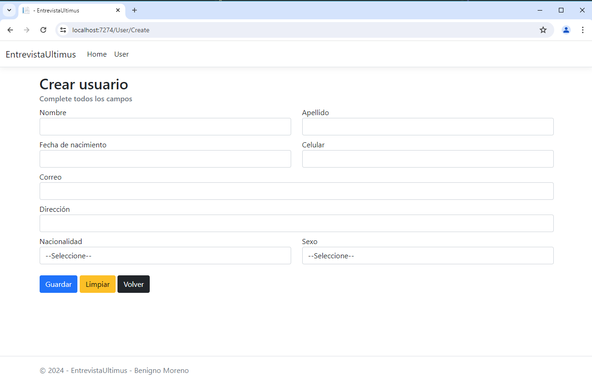

# Proyecto CRUD de Usuarios

Este proyecto fue desarrollado como una prueba técnica para una entrevista. Se trata de una aplicación CRUD (Crear, Leer, Actualizar, Eliminar) de usuarios, implementada siguiendo estándares de desarrollo y aplicando buenas prácticas de programación.

## Características

- **Crear Usuario**: Permite agregar nuevos usuarios al sistema.
- **Leer Usuarios**: Lista todos los usuarios registrados en el sistema.
- **Actualizar Usuario**: Permite editar la información de los usuarios existentes.
- **Eliminar Usuario**: Permite borrar usuarios del sistema.

## Capturas de Pantalla

### Listado de Usuarios
Aquí puedes ver cómo se presenta el listado de usuarios registrados en el sistema.


### Creación de Usuario
Pantalla para agregar un nuevo usuario.



### Edición de Usuario
Pantalla para editar la información de un usuario existente.


### Eliminación de Usuario
Confirmación para eliminar un usuario del sistema.


## Base de Datos

El proyecto utiliza una base de datos MySQL por defecto. Sin embargo, si prefieres utilizar una base de datos SQL Server, solo necesitas modificar la cadena de conexión en el archivo de configuración.

### Configuración de la Cadena de Conexión

1. **MySQL**: La cadena de conexión para MySQL se encuentra en el archivo `appsettings.json`:
    ```json
    "ConnectionStrings": {
        "DefaultConnection": "Server=tu-servidor;Database=tu-base-de-datos;User=tu-usuario;Password=tu-contraseña;"
    }
    ```

## Instalación

Sigue estos pasos para ejecutar el proyecto localmente:

1. **Clona el repositorio**:
    ```bash
    git clone https://github.com/tu-usuario/tu-repositorio.git
    ```

2. **Navega al directorio del proyecto**:
    ```bash
    cd tu-repositorio
    ```

3. **Restaura las dependencias**:
    ```bash
    dotnet restore
    ```

4. **Ejecuta la aplicación**:
    ```bash
    dotnet run
    ```

## Estructura del Proyecto

- **Controllers**: Contiene los controladores de la aplicación.
- **Models**: Contiene las clases que representan los datos.
- **ViewModels**: Contiene las clases que representan los modelos de vista, utilizados para pasar datos entre la vista y el controlador.
- **Views**: Contiene las vistas de la aplicación (Razor Pages).
- **wwwroot**: Contiene los archivos estáticos, como CSS, JavaScript e imágenes.

## Estándares de Desarrollo y Buenas Prácticas

- **Separación de responsabilidades**: El proyecto sigue el patrón MVC (Modelo-Vista-Controlador) para separar las preocupaciones.
- **Inyección de dependencias**: Se utiliza la inyección de dependencias para gestionar las dependencias entre clases.
- **Validación del lado del servidor y del cliente**: Se implementa la validación de datos tanto en el servidor como en el cliente.

## Licencia

Este proyecto está licenciado bajo la Licencia MIT - ver el archivo [LICENSE](LICENSE) para más detalles.
